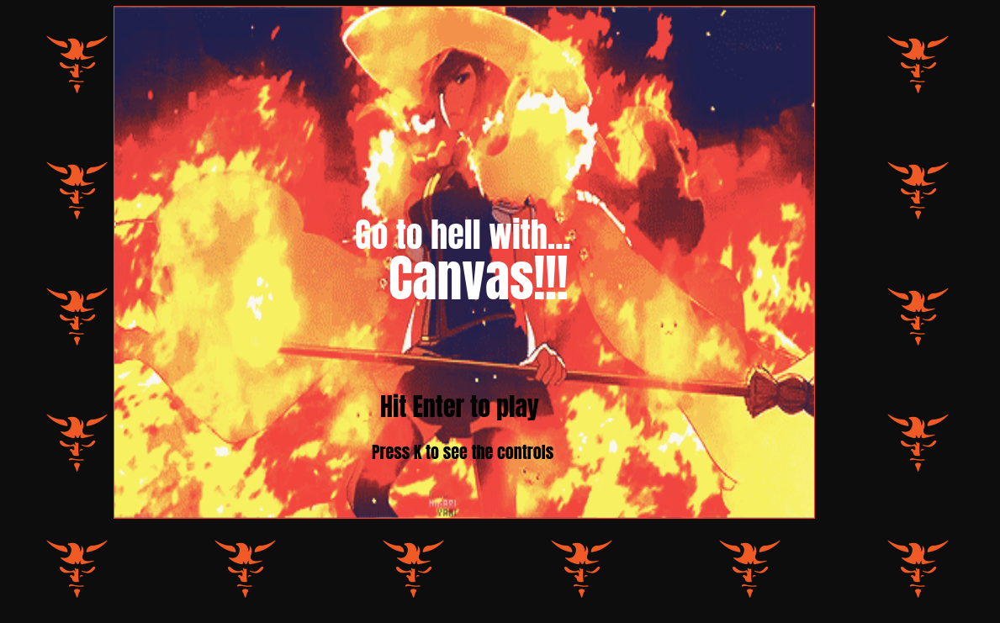
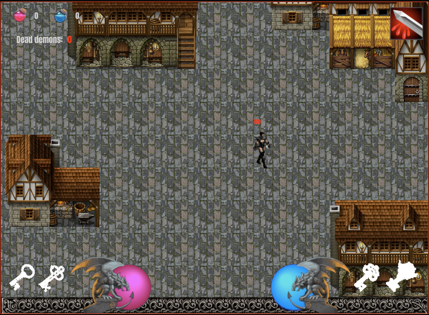

# Go to hell with... Canvas!!!

<!-- PROJECT LOGO -->

  
   

  <!-- <h3 align="center">Infect Me</h3> -->

  

    Project-game 
     
    <a href="https://github.com/joselrdg/project-game"><strong>Explore the docs »</strong></a>
     
     
    <a href="https://joselrdg.github.io/project-game/">View Demo</a>
    ·
    <a href="https://github.com/joselrdg/project-game/issues">Report Bug</a>
    ·
    <a href="https://github.com/joselrdg/project-game/issues">Request Feature</a>
  

<!-- ABOUT THE PROJECT -->
## About

Go to hell with canvas, it is a version of the famous game Diablo, made entirely in pure JavaScript and html.
In the game you will have to overcome a series of missions in which you will have to find the keys to hell and to go down to the underworld to kill Mephisto and other Diablo II characters.

<!-- Here's a blank template to get started:
**To avoid retyping too much info. Do a search and replace with your text editor for the following:**
`github_username`, `repo_name`, `twitter_handle`, `email`, `project_title`, `project_description` -->

### Built With 🛠️

* [Vanilla JavaScrips](https://developer.mozilla.org/en-US/docs/Web/JavaScript/)
* [HTML5](https://developer.mozilla.org/en-US/docs/Web/HTML/)

<!-- ROADMAP -->
## Roadmap

See the [open issues](https://github.com/joselrdg/Infect-me/issues) for a list of proposed features (and known issues).

<!-- CONTRIBUTING -->
## Contributing ✒️

Contributions are what make the open source community such an amazing place to be learn, inspire, and create. Any contributions you make are **greatly appreciated**.

1. Fork the Project
2. Create your Feature Branch (`git checkout -b feature/AmazingFeature`)
3. Commit your Changes (`git commit -m 'Add some AmazingFeature'`)
4. Push to the Branch (`git push origin feature/AmazingFeature`)
5. Open a Pull Request

<!-- LICENSE -->
## License 

Distributed under the MIT License. See `LICENSE` for more information.

<!-- CONTACT -->
## Contact

José Luis Rodríguez , [josesietepicos@gmail.com](mailto:josesietepicos@gmail.com)

Project Link: [https://github.com/joselrdg/Infect-me](https://github.com/joselrdg/Infect-me)

Project Link: [https://infectme.herokuapp.com/](https://infectme.herokuapp.com/)

